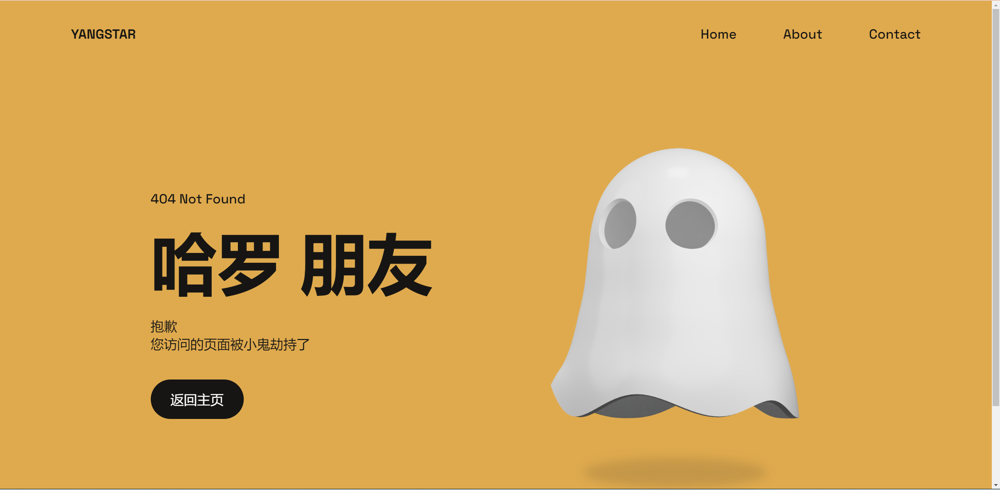
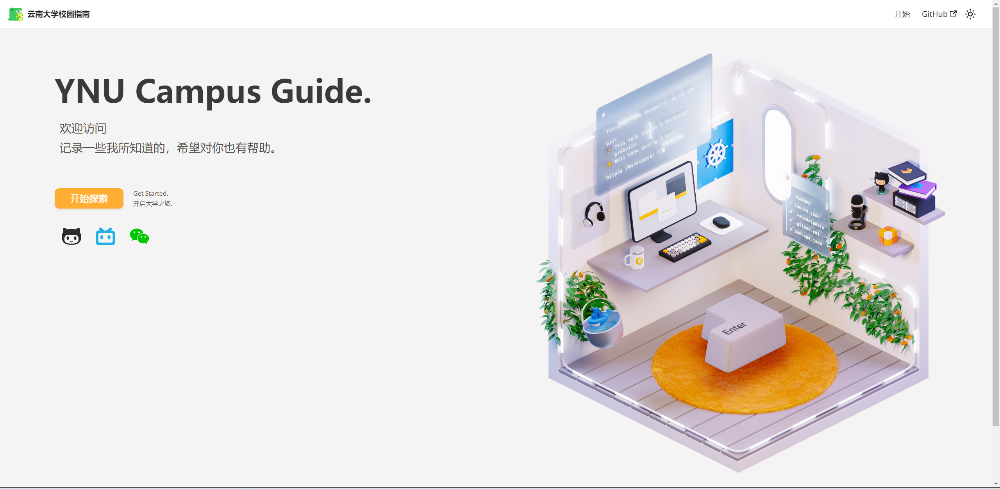
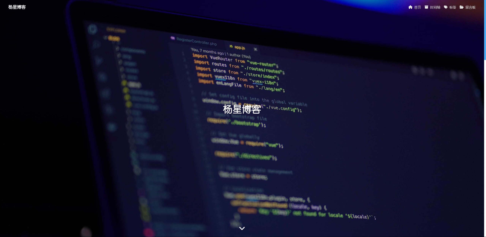

# lab
> 欢迎来到我的实验室:star2:
>
> 在这里将会存放我的一些项目:night_with_stars:

## [404页面](https://yangstar23.github.io/404Page/)
>html+css+javascript

## [个人主页](https://yangstar23.github.io/responsive-portfolio-website-JhonDoe/)
>html+css+javascript

## [YNU Campus Guide](https://yangstar23.github.io/Docusaurus_web/)
>基于Docusaurus搭建的文档

## [我的博客](https://yangstar23.github.io/)
>基于hexo搭建的个人博客
>

